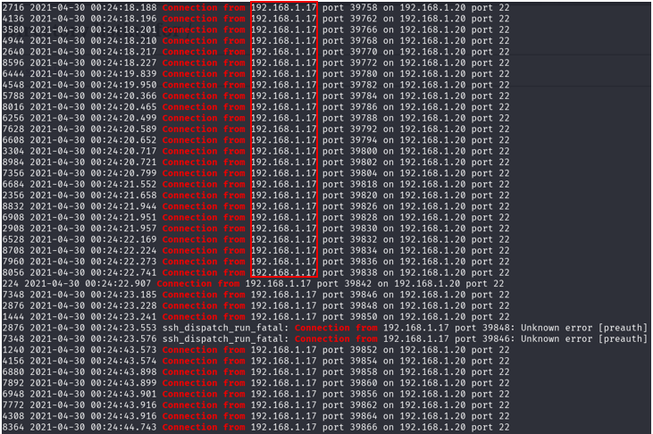
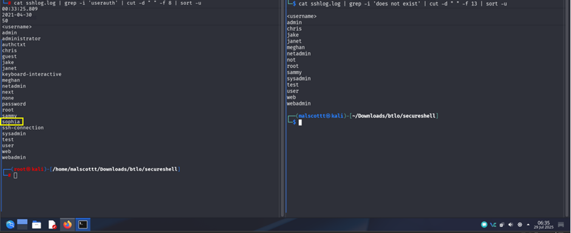
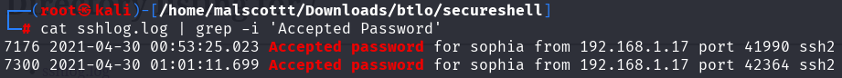
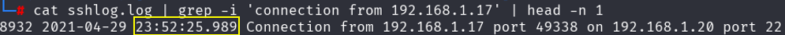
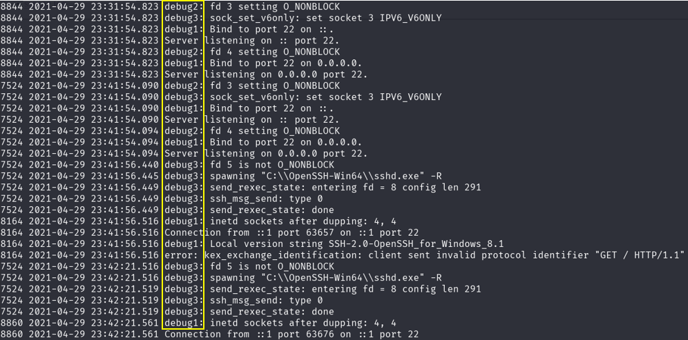

# Secure Shell

**Scenario**

_Hey! We had a SSH service on a system and noticed unusual change in size of the log file. Don’t panic, it was the new IT guys’ daughter who said she was able to break into the system. I had given her permission to test some of these services. I am giving you the log file, can you solve the following queries?_


**Question 1:**\
Is it an internal or external attack, what is the attacker IP?

```bash
cat sshlog.log | grep -i 'connection from'
```



From the command above, we filter it to see where the connection come from. We can see multiple connection attempts from the IP `192.168.1.17`. Since this IP is within the 192.168.x.x private range, it indicates that the attack originated internally from the local network.

**Answer:**\
internal:192.168.1.17


**Question 2:**\
How many valid accounts did the attacker find, and what are the usernames?

```bash
cat sshlog.log | grep -i 'userauth' | cut -d " " -f 8 | sort -u
cat sshlog.log | grep -i 'does not exist' | cut -d " " -f 13 | sort -u
```

<figure><figcaption></figcaption></figure>

The first command lists all usernames that had authentication attempts:

```bash
cat sshlog.log | grep -i 'userauth' | cut -d " " -f 8 | sort -u
```

The second command lists usernames that do not exist on the system:

```bash
cat sshlog.log | grep -i 'does not exist' | cut -d " " -f 13 | sort -u
```

We filter `userauth` to see all login attempts and `does not exist` to find invalid accounts. Any username in userauth but not in does not exist is a valid account. From the output, the only valid account found is: **sophia**

**Answer:**\
sophia


**Question 3:**\
How many times did the attacker login to these accounts?

```bash
cat sshlog.log | grep -i 'Accepted Password'
```



We use this command to find successful SSH logins because the log records the phrase `Accepted Password` whenever an attacker successfully authenticates. From the output, the attacker logged in 2 times.

**Answer:**\
2


**Question 4:**\
When was the first request from the attacker recorded?

```bash
cat sshlog.log | grep -i 'connection from 192.168.1.17' | head -n 1
```



We use this command to find the first request because it shows the earliest log entry from the attacker’s IP. Using `head -n 1` displays the first occurrence, which marks the start of the attack.

**Answer:**\
23:52:25.989


**Question 5:**\
What is the log level for the log file?

```bash
head -30 sshlog.log
```



We check the first 30 lines of the log using this command to identify the log level, which is `debug`. Log levels indicate the detail and importance of log entries:

* `DEBUG` – Very detailed logs for troubleshooting
* `INFO` – Normal operational events
* `WARNING` – Something unusual but not critical
* `ERROR`– A problem occurred

Using **DEBUG** helped capture **all SSH activity**, making the attack easy to trace.

**Answer:**\
debug
